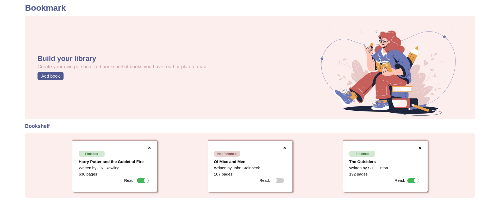
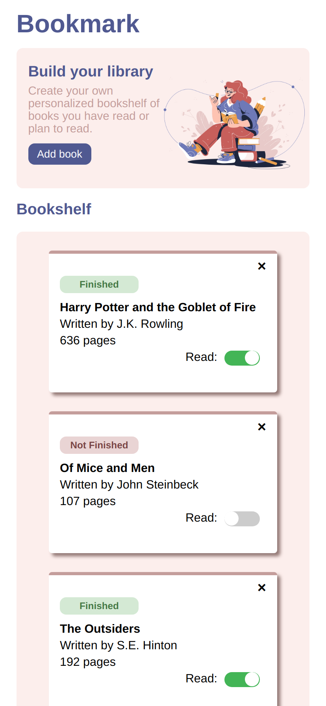

# Library App

## Demo 
https://ken862734801.github.io/Library-App/

## Preview

View on mobile.

## Summary

The goal of this Odin Project assignment was to use utilize Javascript object constructors and user input data in order to create a simple library app.

[Link to the assignment.](https://www.theodinproject.com/lessons/node-path-javascript-library)

For now I am happy with the state of the project. There are still small bugs that I plan to fix in the future. I need to make the identification process of matching an item in the array stricter. Right now the code checks to see if the bookcard id is the same as the array elements title; however; if the user uploads two books with the same title errors occur. I think it's probably a simple fix but we'll see when I come back to it. 

### Features
- User can upload book to library.
- User can delete book from library.
- User can update the status of the book (Finished or Not Finished).
- Mobile responsive. 

## Resources

Like most of my projects stackoverflow and google were my best friends for this project. I had a hard time figuring out how to get the input data from the form, and use it with the DOM; however, template literals made that easier.

### This UI served as the template.
https://dribbble.com/shots/14240831-Booksy-Online-Book-Shop

https://dribbble.com/shots/15328333-Reading
